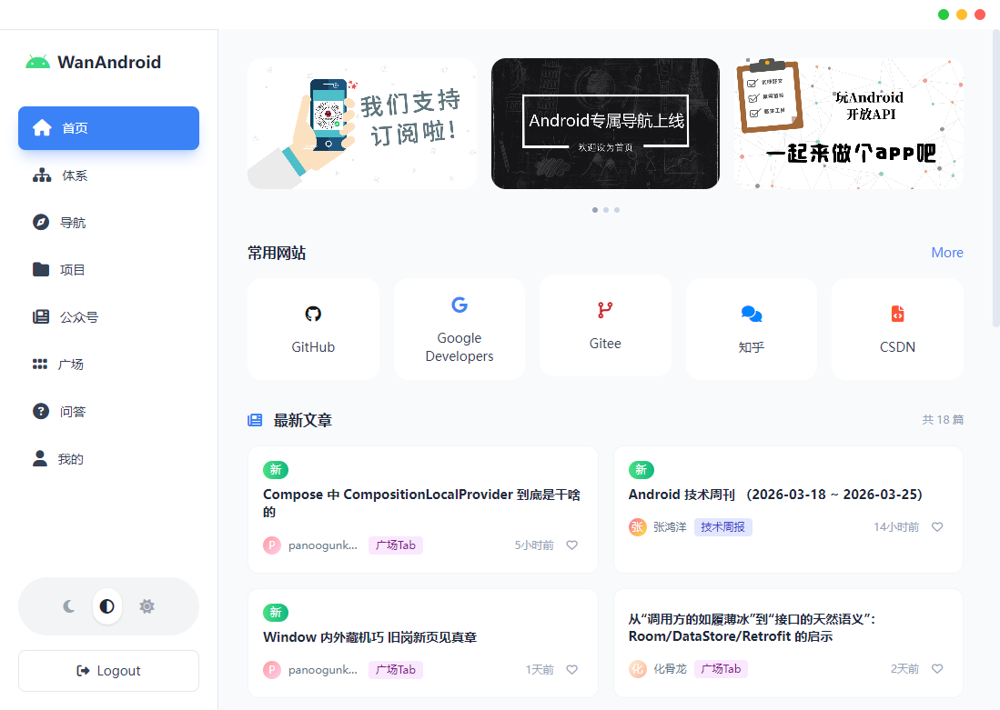
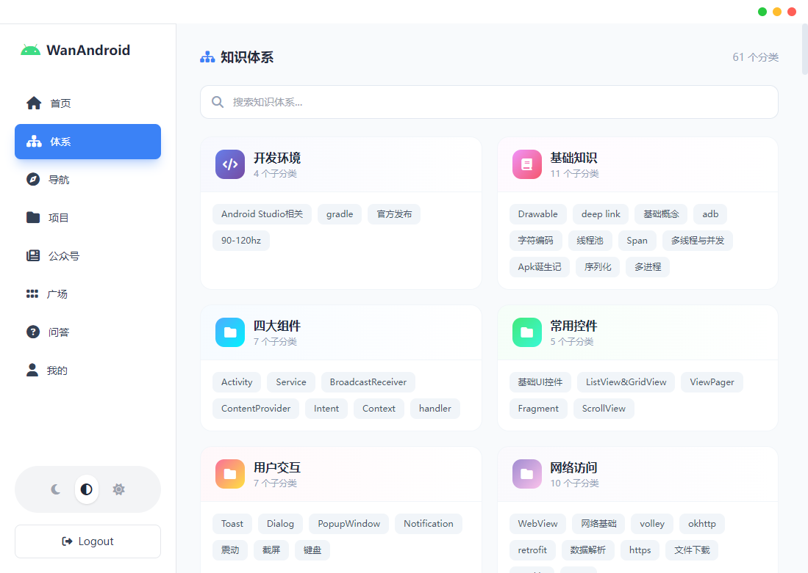
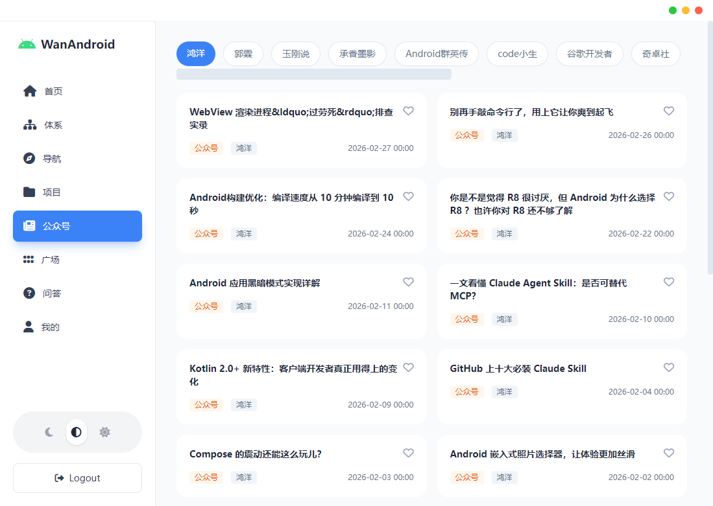
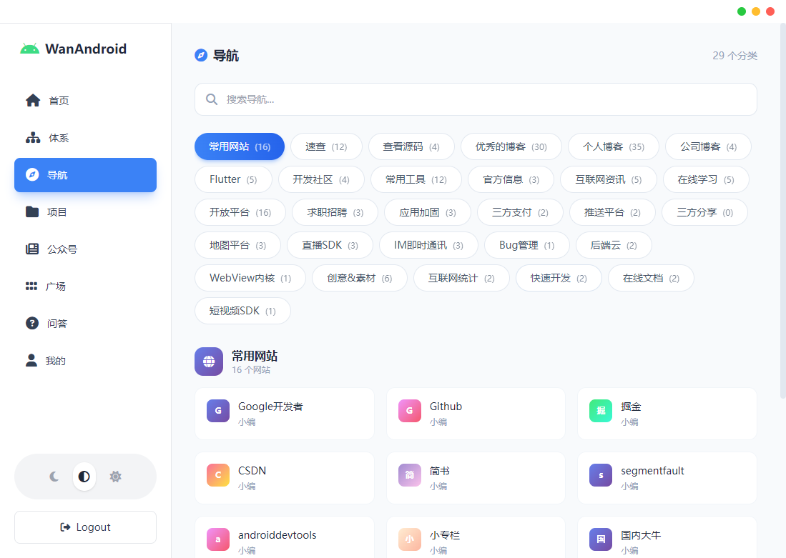
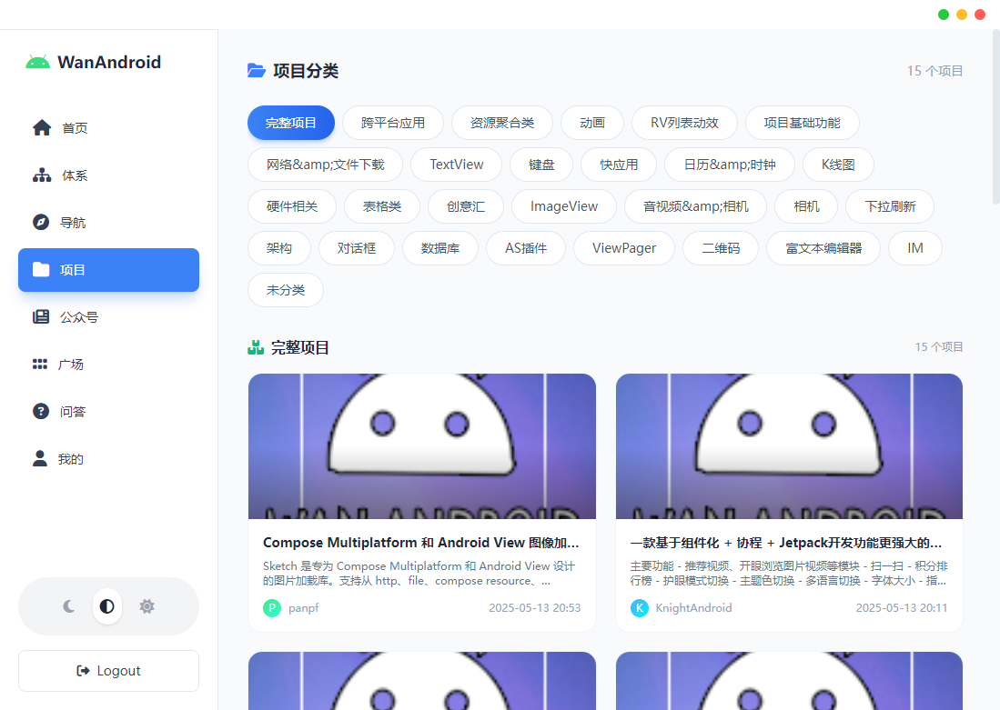
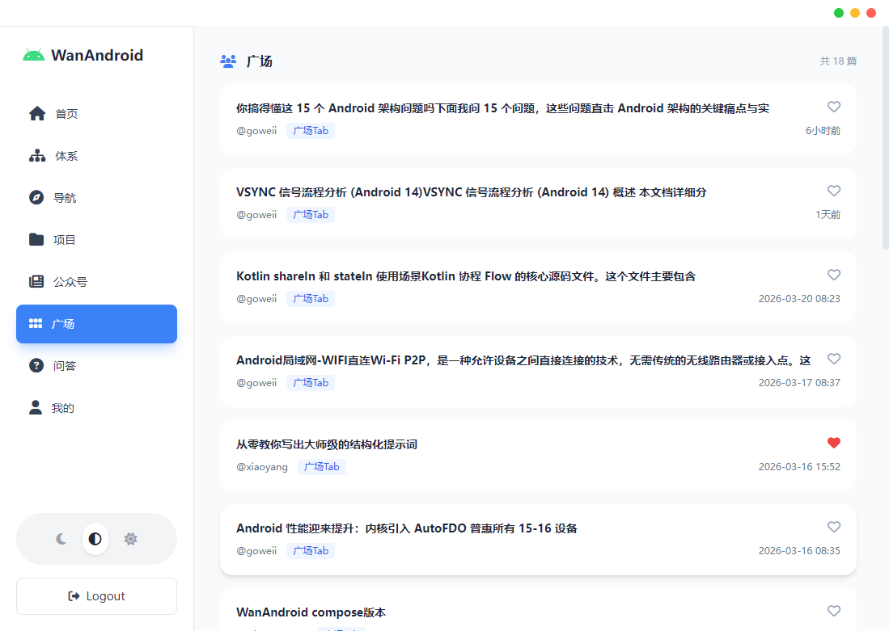
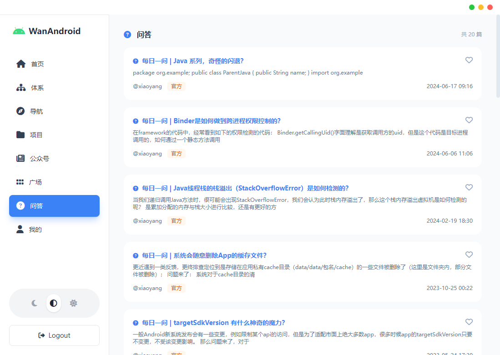
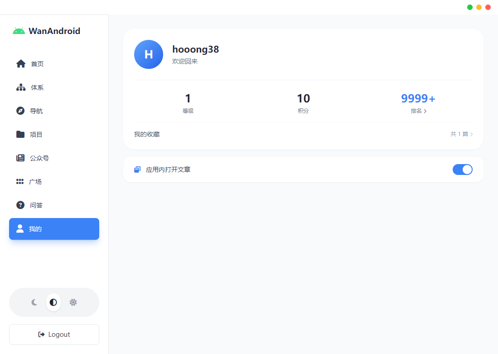
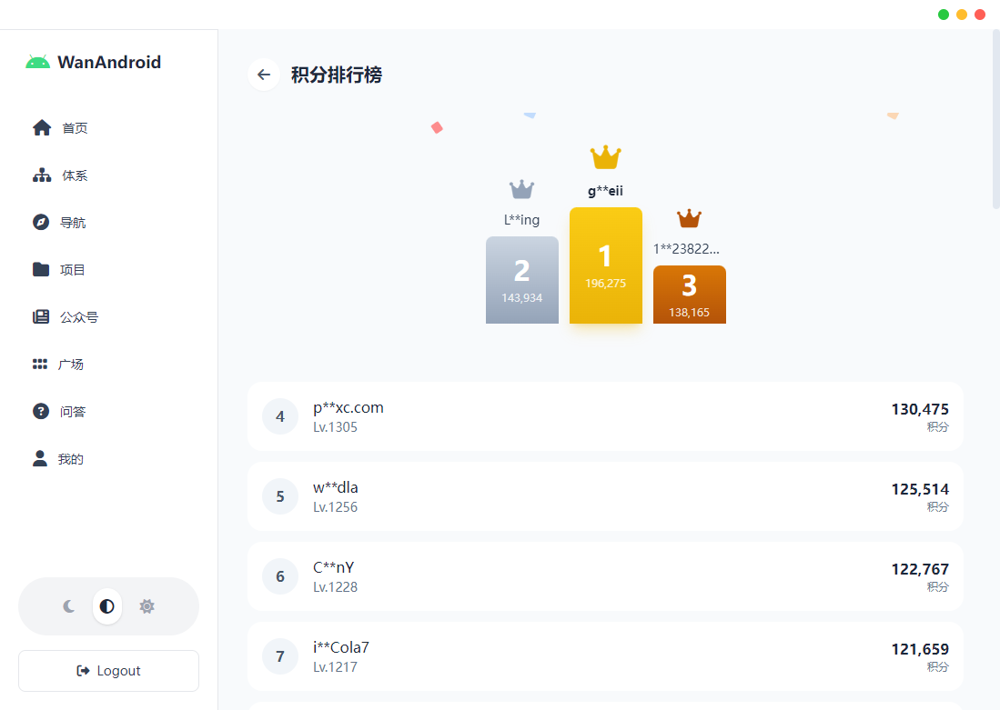
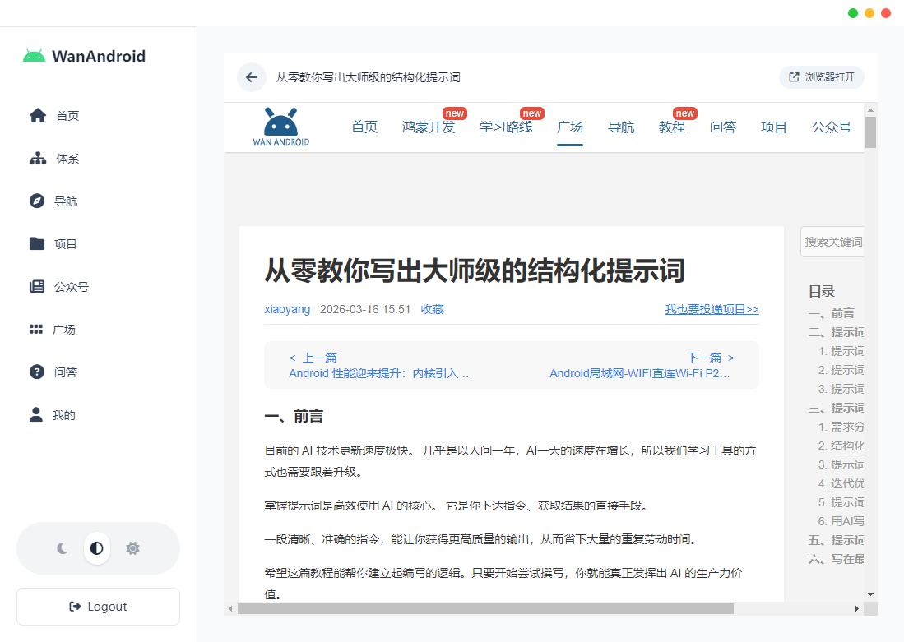

# WanAndroid Desktop

一个基于 Electron + Vue 3 + TypeScript 的 WanAndroid 桌面应用，提供完整的 Android 开发者社区内容浏览和管理功能。

## ✨ 特性

### 🎯 核心功能

- **知识体系浏览** - 完整的 Android 知识体系分类
- **分类文章** - 按分类查看技术文章
- **常用导航** - 快速访问常用开发资源
- **项目推荐** - 精选优质开源项目
- **公众号文章** - 关注的微信公众号文章聚合
- **技术问答** - 社区问答互动
- **收藏管理** - 收藏喜爱的文章，支持同步
- **积分排行榜** - 实时积分排名展示
- **应用内浏览** - 可配置应用内或浏览器打开文章

### 🎨 界面特性

- **现代化 UI** - 采用 Material Design 设计语言
- **深色主题** - 支持深色/浅色主题切换
- **响应式布局** - 自适应不同窗口大小
- **流畅动画** - 细腻的过渡和交互效果

### ⚡ 技术特性

- **Webview 浏览** - 绕过 X-Frame-限制，完整网页体验
- **拦截链接跳转** - 应用内打开所有链接，无缝浏览
- **TypeScript** - 完整的类型安全支持
- **Vite 构建** - 快速的开发和构建体验
- **Pinia 状态管理** - 简单高效的状态管理
- **路由管理** - Vue Router 4 单页应用

## 📸 运行效果图























## 🚀 快速开始

### 环境要求

- Node.js >= 16.x
- npm >= 8.x

### 安装依赖

```bash
npm install
```

### 开发模式

```bash
npm run dev
```

应用会自动启动，主窗口会显示 Electron 应用界面。

### 构建应用

```bash
npm run build
```

构建产物位于 `dist-electron` 目录。

### 预览生产构建

```bash
npm run preview
```

## 📖 使用指南

### 登录/注册

1. 点击"我的"标签页
2. 点击"登录 / 注册"按钮
3. 输入用户名和密码
4. 完成注册/登录

### 文章浏览

应用支持两种浏览模式，可在"我的"页面设置：

**应用内浏览（推荐）**
- 优点：不离开应用，无缝体验
- 支持：完整网页功能，无限制

**浏览器打开**
- 优点：独立窗口，便于多任务
- 适用：需要与其他应用协同工作

### 收藏文章

- 在任何文章卡片上点击心形图标
- 收藏的文章会自动同步到"我的收藏"页面
- 可再次点击心形图标取消收藏

### 积分系统

- 完成注册即可获得初始积分
- 阅读文章、每日签到等方式获得积分
- 在"我的"页面查看积分和排名

## 🏗️ 技术栈

- **框架**: Electron + Vue 3
- **语言**: TypeScript
- **构建工具**: Vite
- **状态管理**: Pinia
- **路由**: Vue Router 4
- **样式**: Tailwind CSS
- **HTTP 客户**: Axios
- **图标**: FontAwesome

## 📁 项目结构

```
wanandroid-desktop/
├── electron/          # Electron 主进程代码
├── src/
│   ├── api/           # API 接口
│   ├── assets/        # 静态资源
│   ├── components/    # Vue 组件
│   ├── stores/        # Pinia 状态管理
│   ├── types/         # TypeScript 类型定义
│   ├── utils/         # 工具函数
│   └── views/         # 页面组件
│       ├── home/       # 首页
│       ├── hierarchy/  # 知识体系
│       ├── category/   # 分类文章
│       ├── navigation/ # 导航
│       ├── projects/   # 项目推荐
│       ├── wechat/     # 公众号
│       ├── square/     # 广场
│       ├── qa/         # 问答
│       ├── profile/    # 个人中心
│       ├── collect/    # 我的收藏
│       ├── rank/       # 积分排行榜
│       └── article/    # 文章浏览（webview）
├── public/           # 公共资源
├── 运行效果图/     # 运行截图
└── package.json
```

## 🎯 核心功能实现

### Webview 浏览

使用 Electron 的 `<webview>` 标签实现应用内网页浏览，具有以下优势：

- **绕过限制** - 绕过 X-Frame-Options 和 CSP 策网页安全策略
- **完整体验** - 支持 JavaScript、表单、弹窗等所有网页功能
- **链接拦截** - 拦截所有链接点击，在应用内打开，不弹出新窗口
- **加载状态** - 显示加载动画和加载时间，提升用户体验

### 用户系统

- **登录/注册** - 完整的用户认证流程
- **本地存储** - 自动登录功能，记住用户偏好
- **积分系统** - 积分获取、排名展示
- **收藏同步** - 跨设备同步收藏数据

### 主题切换

- **浅色主题** - 适合白天使用，清晰明亮
- **深色主题** - 适合夜间使用，保护视力
- **系统跟随** - 自动跟随系统主题

## 🐛 常见问题

### Q: 为什么有些文章无法在应用内打开？

A: 部分网站设置了严格的 X-Frame-Options 策略，会阻止在 iframe 中嵌入。应用使用 Electron 的 `<webview>` 标签绕过了这个限制，可以正常浏览。如果遇到加载超时，可以尝试使用"浏览器打开"功能。

### Q: 如何切换应用内/浏览器打开文章？

A: 
1. 进入"我的"页面
2. 找到"应用内打开文章"开关
3. 打开：在应用内使用 webview 浏览
4. 关闭：在默认浏览器中打开

### Q: 积分如何获取？

A: 
- 注册账号即获得初始积分
- 每日签到获得积分
- 阅读文章可能获得积分
- 其他社区互动行为也可获得积分

### Q: 收藏数据会丢失吗？

A: 收藏数据存储在本地，清除应用数据或重装应用会丢失。建议定期备份重要收藏。

## 📄 开源协议

本项目基于 WanAndroid API 开发，仅供学习交流使用。

## 🤝 贡献

欢迎提交 Issue 和 Pull Request！

## 📧 联系方式

如有问题或建议，欢迎通过 GitHub Issues 反馈。

---

**WanAndroid Desktop** - 让 Android 开发更高效 🚀
